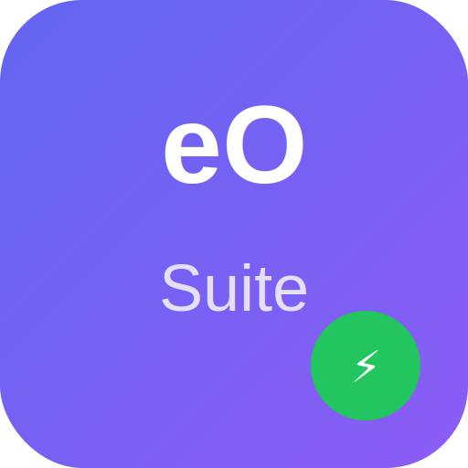

<p align="center">
  
</p>

<h1 align="center">eOffice Suite</h1>

<p align="center">
  <strong>AI-Powered Office Productivity Suite with eBot LLM Integration</strong>
</p>

<p align="center">
  
  
  
  
  
  
</p>

---

## 📦 What is eOffice?

eOffice is a complete open-source office productivity suite — like Microsoft 365 — with built-in **AI/LLM intelligence** powered by **eBot**. It runs on Windows, macOS, Linux, browsers, Chrome Extension, and as a PWA.

### 12 Applications

| App | Description | MS 365 Equivalent | AI Features |
|-----|-------------|-------------------|-------------|
| 📝 **eDocs** | Word processor with rich text editing | Word | Spell check, grammar fix, rewrite, translate, summarize |
| 📒 **eNotes** | Digital notebooks | OneNote | Auto-tag, find related, extract tasks, summarize |
| 📊 **eSheets** | Spreadsheets with formulas & **charts** | Excel | Formula suggest, formula explain, data analysis |
| 📽️ **eSlides** | Presentations | PowerPoint | Slide content generation, talking points |
| ✉️ **eMail** | Email client (real SMTP/IMAP) | Outlook | Spell check, rewrite (4 tones), smart compose, draft reply, summarize, extract tasks, translate |
| 🗄️ **eDB** | Database manager | Access | Natural language → SQL, query explanation |
| ☁️ **eDrive** | Cloud file manager | OneDrive | Semantic search, file summarization |
| 💬 **eConnect** | Team messaging + **video calling** | Teams | Thread summarize, draft message, WebRTC video |
| 📋 **eForms** | Form builder & surveys | Forms | Field suggestions, question improvement |
| 🎨 **eSway** | Design canvas | Sway | Quiz generation, poll suggestions |
| 📅 **ePlanner** | Project planning (Kanban) | Planner | Extract tasks, priority suggestions |
| 🚀 **Launcher** | App hub | 365 Launcher | — |

---

## 🚀 Quick Start

### Prerequisites

- **Node.js** ≥ 18.0.0
- **pnpm** ≥ 9.0 (or npm)

### Install & Run

```bash
# Clone the repo
git clone https://github.com/embeddedos-org/eOffice.git
cd eOffice

# Install dependencies
pnpm install

# Start the server (port 3001)
npm run dev:server

# Start any app (in another terminal)
npm run dev:email    # eMail on http://localhost:5177
npm run dev:docs     # eDocs on http://localhost:5173
npm run dev:sheets   # eSheets
npm run dev:slides   # eSlides
npm run dev:notes    # eNotes
npm run dev          # Launcher (all apps)
```

### Run Tests

```bash
cd packages/server
npx vitest run        # 64 tests across 6 test suites
```

---

## 🖥️ Platform Support

| Platform | Status | How to Use |
|----------|--------|-----------|
| 🌐 **Browser (React)** | ✅ Ready | `npm run dev:<app>` — Vite dev server |
| 📄 **Browser (HTML)** | ✅ Ready | Open `browser/*.html` — works offline |
| 🪟 **Windows Desktop** | ✅ Built | `desktop/dist/eOffice Suite Setup 0.1.0.exe` |
| 🐧 **Linux Desktop** | ✅ Built | `desktop/dist/eOffice Suite-0.1.0.AppImage` |
| 🍎 **macOS Desktop** | ✅ CI Ready | Built via GitHub Actions on `macos-latest` |
| 🧩 **Chrome Extension** | ✅ Ready | Load `extensions/browser/` in `chrome://extensions` |
| 📱 **PWA** | ✅ Ready | Install via Chrome/Edge |

### Build Desktop

```bash
cd desktop
npm install

# Windows (from Windows)
npm run build:win

# Linux (from Linux/WSL)
npm run build:linux

# macOS (from macOS only)
npm run build:mac

# All platforms (CI)
npm run build:all
```

---

## 🤖 eBot AI Integration

Every app connects to **eBot** — an AI/LLM backend that provides intelligent features across the suite.

### 33+ AI Actions

| Category | Actions |
|----------|---------|
| **Writing** | Spell check, grammar fix, rewrite (formal/casual/concise/friendly), improve, translate |
| **Productivity** | Summarize, extract tasks, suggest priority, auto-tag |
| **Spreadsheets** | Natural language → formula, formula explanation, data analysis |
| **Presentations** | Generate slide content, create talking points |
| **Database** | Natural language → SQL, query explanation |
| **Search** | Semantic cross-app search |
| **Email** | Smart compose, draft reply, smart reply |
| **Forms** | Field suggestions, question improvement |
| **Design** | Quiz generation, poll suggestions |

### eBot Architecture

```
React App → useEBot() hook → /api/ebot/* → EAI Server (LLM)
                                    ↓
                            eBot Proxy Server
                            (localhost:3001)
```

Server endpoints: `/api/ebot/chat`, `/complete`, `/summarize`, `/task-extract`, `/search`, `/models`, `/tools`, `/status`

---

## 🏗️ Architecture

```
eOffice/
├── apps/                     # 12 React apps (Vite + TypeScript + React 19)
│   ├── edocs/                # Word processor
│   ├── enotes/               # Notebooks
│   ├── esheets/              # Spreadsheets (with Chart component)
│   ├── eslides/              # Presentations
│   ├── email/                # Email (SMTP/IMAP + AI composer)
│   ├── edb/                  # Database manager
│   ├── edrive/               # Cloud file manager
│   ├── econnect/             # Messaging + WebRTC video
│   ├── eforms/               # Form builder
│   ├── esway/                # Design canvas
│   ├── eplanner/             # Project planning
│   └── launcher/             # App launcher hub
├── browser/                  # 11 standalone HTML versions (offline)
├── desktop/                  # Electron wrapper (Win/Mac/Linux)
│   ├── dist/                 # Built installers
│   ├── main.js               # Electron main process
│   └── preload.js            # Context bridge
├── extensions/
│   └── browser/              # Chrome Extension (Manifest V3)
├── packages/
│   ├── core/                 # Shared utilities + file export
│   ├── ebot-client/          # AI/LLM client SDK
│   └── server/               # Express API server
│       ├── src/routes/       # 14 route files (154+ endpoints)
│       ├── src/services/     # Email, collaboration, signaling
│       └── src/__tests__/    # 64 unit tests (vitest)
├── web/                      # PWA (manifest + service worker)
├── .github/workflows/        # CI/CD (desktop builds)
└── docs/                     # Architecture documentation
```

### Tech Stack

| Layer | Technology |
|-------|-----------|
| Frontend | React 19, TypeScript 5, Vite 5/6 |
| Backend | Express 4, Node.js 20 |
| Email | nodemailer (SMTP), imapflow (IMAP), mailparser |
| Realtime | WebSocket (ws) — collaboration + video signaling |
| Video | WebRTC peer-to-peer |
| Desktop | Electron 28, electron-builder |
| Testing | Vitest 1.x |
| AI/LLM | eBot client → EAI server proxy |

---

## ✉️ Email Features

The eMail app supports real SMTP/IMAP with any email provider:

- **Providers**: Gmail, Outlook, Yahoo, or custom IMAP/SMTP servers
- **Security**: AES-256-GCM encrypted credential storage
- **Features**: Send, receive, star, mark read, delete, folders, auto-refresh (30s)
- **Attachments**: Upload and send file attachments (up to 25MB)
- **AI**: 8 AI-powered actions in composer and sidebar

### Configure Email

1. Start the server: `npm run dev:server`
2. Open eMail: `npm run dev:email`
3. Click ⚙️ → Add Account → Select provider → Enter credentials
4. For Gmail: Use an [App Password](https://myaccount.google.com/apppasswords)

---

## 📊 Charts (eSheets)

eSheets includes a built-in SVG chart engine with:
- **Bar charts** — grouped multi-series
- **Line charts** — with data points
- **Area charts** — filled line charts
- **Pie charts** — with percentage labels

No external charting library required — pure SVG rendering.

---

## 🎥 Video Calling (eConnect)

eConnect includes WebRTC-based video calling:
- **Peer-to-peer** — direct connection between participants
- **Features**: Mute, camera toggle, screen sharing
- **Signaling**: WebSocket server at `ws://localhost:3001/ws/signal`
- **ICE**: Uses Google STUN servers for NAT traversal

---

## 🤝 Real-time Collaboration

eDocs supports real-time co-authoring via WebSocket:
- **Live sync**: Document edits broadcast to all users instantly
- **Presence**: See who's editing with colored cursors
- **Conflict-free**: Server maintains document state
- **WebSocket**: `ws://localhost:3001/ws/collab`

---

## 📤 File Export

Export documents in multiple formats (client-side, no server needed):

| App | Formats |
|-----|---------|
| eDocs | `.doc`, `.html`, `.md`, `.pdf` (print) |
| eSheets | `.xls`, `.csv` |
| eSlides | `.ppt` |

---

## 🧪 Testing

```bash
# Run all server tests
cd packages/server && npx vitest run

# Test results:
# ✓ routes.test.ts         (12 tests)  — Document & Note CRUD
# ✓ spreadsheets.test.ts   (14 tests)  — Spreadsheet operations
# ✓ email.test.ts          (14 tests)  — Email routes & events
# ✓ email-config.test.ts   (7 tests)   — Encrypted account storage
# ✓ email-service.test.ts  (5 tests)   — Provider presets
# ✓ all-routes.test.ts     (12 tests)  — All app routes
# Total: 64 tests passing
```

---

## 📜 License

MIT — See [LICENSE](LICENSE) for details.

---

<p align="center">
  Built with ❤️ by the <a href="https://github.com/embeddedos-org">EoS Project</a>
</p>
